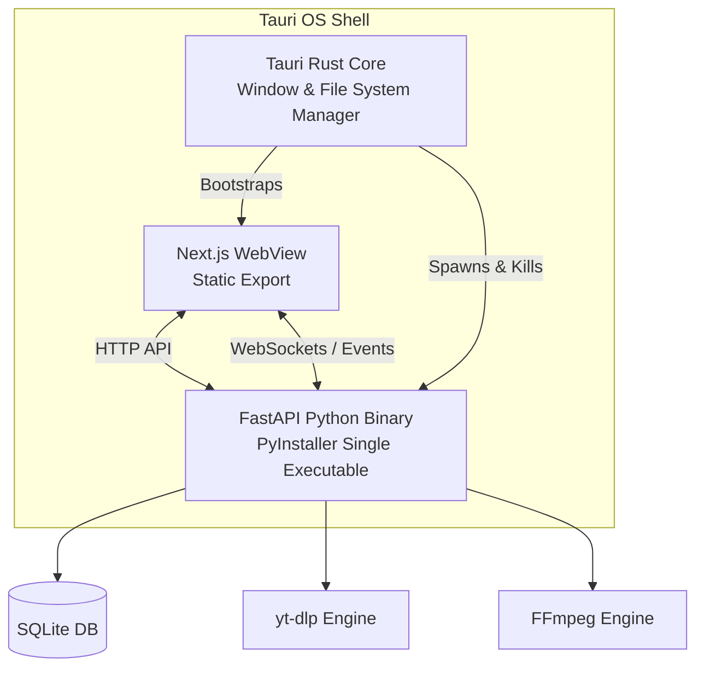

<div align="center">
  
  <h1>Nextract</h1>
  <p><strong>A clean, local-first media extraction and downloading app.</strong></p>
  
  <p>
    
    
    
    
    
  </p>
</div>

---

## 🌟 Vision

**Nextract** (Nexus + Extract) acts as a connection point between platforms, media, and the user—pulling allowed media into an organized personal vault. 

It starts as a powerful YouTube downloader supporting multiple video qualities, audio-only downloads, and full playlists, wrapped in a polished productivity tool that feels like a native OS application, rather than a suspicious downloader website.

The experience is simple:
```text
Paste link → Analyze → Choose quality → Download → Organize
```

## ✨ Features

- **Beautiful Local-First App**: A seamless native desktop experience (powered by Tauri v2).
- **Format Flexibility**: Download media in multiple qualities or extract audio directly.
- **Batch Downloading**: Support for full playlist downloads and a built-in download queue.
- **Robust Under the Hood**: Powered by `yt-dlp` and `FFmpeg` for flawless processing and format conversion.
- **Resilient**: Graceful shutdown handling and resumption for interrupted downloads.
- **Organized**: Built-in history, settings, and structured file saving.

## 🏗️ Architecture

Nextract uses the **Tauri Sidecar Pattern** to seamlessly unite a Next.js static UI, a Python backend, and native OS APIs.



## 🚀 Getting Started

### For Users
See our [Usage Guide](docs/USAGE.md) for information on how to navigate the app, manage downloads, and configure your settings.

### For Developers
Nextract is built with Next.js, FastAPI, and Tauri.
Please refer to the comprehensive [Setup Guide](docs/SETUP.md) for Linux-focused system prerequisites and local development instructions.

## 📚 Documentation

- [Project Vision & Ethics](docs/01-vision.md)
- [Architecture Details](docs/03-architecture.md)
- [Setup Instructions](docs/SETUP.md)
- [Usage Guide](docs/USAGE.md)
- [Release Checklist](docs/RELEASE_CHECKLIST.md)

---

## 🛡️ Product Boundaries & Ethics

Nextract is designed exclusively for downloading media the user owns, has explicit permission to download, or is legally allowed to save. It must not be designed or used for DRM bypassing, piracy, private account scraping, paywall bypassing, or unauthorized downloading.